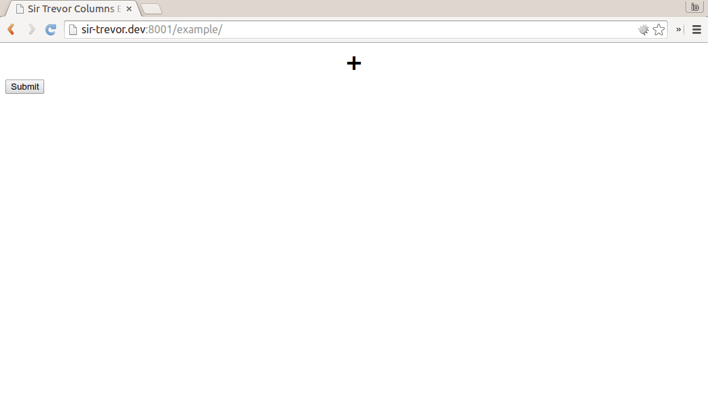

Columns layout block for Sir Trevor Editor
==========================================

About
-----

This plugin introduces columns layout functionality to Sir Trevor Editor. 
It's designed to work with patched version of SirTrevor.
See [e1himself/mr-trevor-js](https://github.com/e1himself/mr-trevor-js) repo.

Patched Sir Trevor is available as `mr-trevor-js` bower package (see bower.json to this repo).  

[Pull request to original Sir Trevor](https://github.com/madebymany/sir-trevor-js/pull/297) is pending now.
 

Installation
------------

1. `bower install e1himself/sir-trevor-columns-block`.
2. See example/index.html for installation demo.

AMD
---

See example/index.amd.html for AMD installation demo.